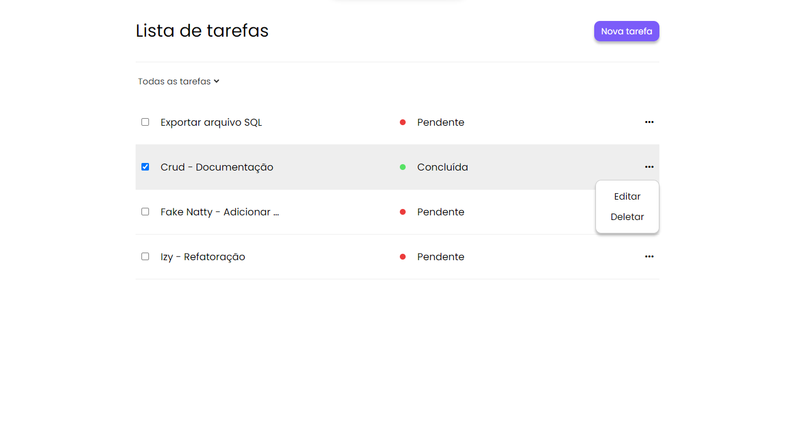

# Teste de Desenvolvimento Web - CRUD
O teste consiste no desenvolvimento de uma lista de tarefas (TODO LIST) com as 4 operações fundamentais do banco de dados.



# Tecnologias utilizadas
* PHP
* MYSQL
* JAVASCRIPT

# Funcionalidades / Requisitos

### 1 - Listagem de tarefas (READ):
* Listar todas as tarefas existentes no banco de dados
* Cada tarefa tem as opções de editar e excluir

### 2 - Criação de tarefas (CREATE)
* O usuário terá um formulário para criar uma nova tarefa, basta colocar o (título) e a (descrição)

### 3 - Edição de tarefas (UPDATE)
* Cada tarefa pode ser editada pelo usuário

### 4 - Exclusão de tarefas (DELETE)
* Cada tarefa pode ser excluída pelo usuário

# Funcionalidades adicionadas a parte

### 1 - Edição do status de tarefas (UPDATE)
* O usuário pode criar uma tarefa e marcar como concluída ou pendente, basta marcar ou desmarcar o checkbox inserido no card de cada tarefa

### 2 - Filtragem de tarefas pelo status (READ)
* É possível organizar a exibição das tarefas, através do status, o que melhora a produtividade do usuário

# Rodando projeto na sua máquina
É fácil, basta ter um ambiente PHP rodando localmente e pronto, vou deixar algumas dicas abaixo:

### 1 - Clone este repositório

```bash
git clone https://github.com/jadielsanttos/teste_inforgenes_php.git
```

# Navegue até a pasta do projeto

```bash
cd teste_inforgeneses_php
```

### 2 - Crie um banco de dados e altere as credenciais (DICA)
* Vou deixar um arquivo SQL na pasta DATABASE, é só importar e pronto

* Configurações e conexão com o banco de dados ficam dentro da pasta app/DB/

### 3 - Acesse [http://localhost](http://localhost) e seja feliz

